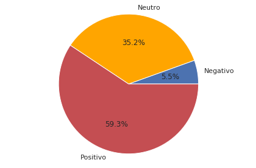

# Visualizando a Poesia de Belchior
*Por Lucas Cabral*

 
*Arte: [Daniel Brandão](https://www.estudiodanielbrandao.com/)*

Antonio Carlos Belchior, mais conhecido como Belchior (Sobral, 26 de outubro de 1946 – Santa Cruz do Sul, 30 de abril de 2017), foi um compositor cearense entre os mais notórios do cancioneiro popular brasileiro.  Dono de uma obra de grande densidade e complexidade estética, literária e filosófica, suas ricas composições são objeto de estudo acadêmico e um marco da cultura cearense. Este trabalho propõe uma análise de suas composições através de técnicas de processamento de linguagem natural e de visualização de dados. Dado a riqueza poético e musica das composições de Belchior, este trabalho não tem a pretenção de realizar uma análise literária ou linguística aprofundada, mas sim, movido por curiosidade e admiração, utilizar ferramentas computacionacias para explorar os padrões sintáticos e estatísticos que permeiam o conjunto de sua obra. Nos interessa saber:

- Qual a distribuição do tamanho das letras das músicas?
- Quais os termos mais relevantes na obra toda? E por música?
- Quais letras possuem maior similaridade? 
- Qual a polaridade de sentimento e o nível de subjetividade dominante na obra? E por música? 
- Quais são as palavras que mais ocorrem juntas? 

Vamos ver o que conseguimos descobrir!

O código de geração das visualizações, bem como uma breve explicação das análises realizadas, estão neste [notebook](https://github.com/cabrau/visualizando_belchior/blob/master/visualizando_belchior.ipynb).

# Sobre os dados
As letras foram extraídas do site [Letras](https://www.letras.mus.br/) através de um [web-crawler](https://github.com/cabrau/visualizando_belchior/blob/master/scrapping_lyrics.ipynb). Dando como input o nome do artista, o web-crawler percorre a lista de todas as músicas do artista, armazenando em uma tabela o título da música, se é uma das mais tocadas e a letra, descartando músicas cuja composição não seja do artista escolhido. Ao total, foram extraídos **91** composições.

Após essa coleta, os dados passaram por uma etapa de [extração de features](https://github.com/cabrau/visualizando_belchior/blob/master/pre_processing_text.ipynb) utilizando técnicas de processamento de linguagem natural, incluindo:

* Contagem de palavras por documento
* Tokenização
* Remoção de stopwords
* Normalização
* Extração de palavras-chave
* Distribuição de frequências de tokens
* Extração de nGramas
* Cálculo de matriz termo-documento (TF-IDF)
* Matriz de similaridade de documentos
* Redução de dimensionalidade com UMAP
* Análise de sentimentos
* Modelagem de tópicos

# Quantidade de palavras nas letras
### [Gráfico de barras e histograma](1_tamanho_musicas.html)
Nestes gráficos podemos explorar a distribuição de quantidade de palavras de todas as composições e as palavras-chave de cada comṕosição. Use o mouse para filtrar o histograma. 

# Termos mais frequentes
Quais os termos que mais se repentem na obra e em quais músicas eles aparecem. 
### [Gráfico de barras](2_frequencia_termos.html) 

# Co-Ocorrência de Termos
### [Rede](3_network.html)
Além de conhecer os termos mais utilizados, podemos visualizar como eles aparecem em conjunto através de uma rede. Cada nó do grafo é uma palavra e uma aresta significa que estas ocorrem juntas. O tamanho dos nós é proporcional a quantidade de vezes que o termo ocorre. 

# Similaridade entre Composições
### [Matriz de Similaridade](4_similaridade_musicas.html)
Uma técnica bastante utilizada em processamento de linguagem natural é o cáculo do [TF-IDF](https://pt.wikipedia.org/wiki/Tf%E2%80%93idf). O valor TF-IDF (abreviação do inglês *term frequency–inverse document frequency*), é uma medida estatística que tem o intuito de indicar a importância de uma palavra de um documento em relação a uma coleção de documentos ou em um corpus linguístico. Através desse cálculo pode-se vetorizar um documento em um espaço n-dimensional, onde n é o tamanho do vocabulário. Assim cada indice dos vetores represanta um signo linguístico do vocabulário, e o seu valor é o tf-idf daquele termo naquele documento. Vetorizando os documentos, pode-se comparar quais são mais similares. Uma métrica básica é a [distância cosseno](https://en.wikipedia.org/wiki/Cosine_similarity). Neste gráfico, podemos ter uma visão geral da obra, considerando as composições mais similares pelas métricas já citadas. 

# Análise de Sentimentos
Esta análise foi realizada utilizando a biblioteca [TextBlob](https://textblob.readthedocs.io/en/dev/). Através de um algoritimo de regressão supervisionado, treinado previamente, dado um texto como entrada a biblioteca estima um valor real para polaridade, em uma escala de -1 (mais negativo) a 1 (mais positivo) e subjetividade em uma escala que varia de 0 (totalmente objetivo), até 1 (totalmente subjetivo). Entretanto, o modelo foi treinado em inglês. Portanto, foi feita uma tradução de cada letra para este idioma, utilizando a mesma biblioteca, para então ser realizada a análise de sentimento. É necessário considerar as limitações dessa abordagem. Primeiro, em algumas composições Belchior explora o uso de linguagem abstratas, com fonemas que não são reconhecidos pelo vocabulário. Além disso, não é muito claro na documentação do TextBlob o significado das escalas de subjetividade e polaridade. Por último, não sabe-se com exatidão o efeito da tradução na análise de sentimento. Nas palavras de Robert Frost, "poesia é o que se perde na tradução". Apesar de tudo, essa técnica permitiu uma exploração interessante do conjunto da obra do compositor e pode ser um passo inicial para análises mais aprofundadas. As categorias discretas de polaridade foram definidas da seguinte maneira:
* x < -0.1 = Negativo
* -0.1 <= x <= 0.1 = Neutro
* x > 0.1 = Positivo 
### [Análise de Sentimentos](5_sentimentos.html)

